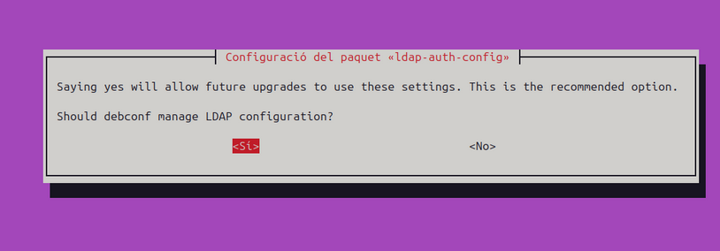
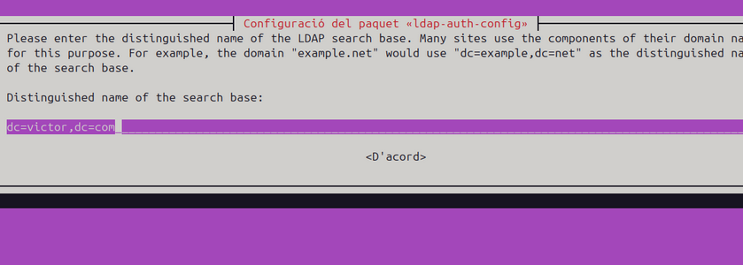
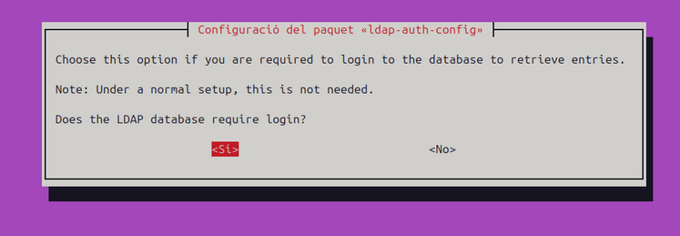

# SPRINT 3

### Instal·lació i Configuració de LDAP a Linux

Començen configurant la màquina amb en xarxa NAT.

.png)

Configurem la ip manualment `10.0.2.15`

.png)

Un cop configurada la ip fem `ip a` i comprovem que esta bé.

.png)

Fem un ping a google per verificar la connexió a internet.

.png)

Posem el nostre hostname en `/etc/hostname `

.png)

Entrem a `/etc/hosts` i cambiem el nostre nom domini

.png)

- 1 Instal·lació dels paquets necessaris

Per instal·lar LDAP en un sistema basat en  Ubuntu, executem la següent comanda:

`apt install libnss-ldap libpam-ldap nscd`

.png)

- 2 Configuració del servidor LDAP

Després d'acceptar la instal·lació, es mostrarà una pantalla de configuració del paquet ldap-auth-config. En aquest apartat haurem d'introduir diverses dades per configurar la connexió amb el servidor LDAP.

2.1 Introduir la URI del servidor LDAP

El sistema ens demanarà la URI Per exemple, si el servidor LDAP està a la IP 10.0.2.15:

Continuem donat-li al sí ja que es el que es recomana.

2.2 Nom distingit de la base de cerca (Search Base DN)

Aquí hem d'introduir el "Distinguished Name" (DN) de la base de dades LDAP. Per exemple, si el domini LDAP és victor.com, escriurem:

`dc=victor,dc=com`

2.3 Seleccionar la versió de LDAP

El sistema ens preguntarà quina versió del protocol LDAP volem utilitzar. Se selecciona normalment la més alta disponible, en aquest cas:

`3`

Ens demana si volem permetre que l'usuari root del sistema pugui gestionar contrasenyes locals com si estiguessin canviant-se a LDAP. Se selecciona:
Sí.

Ens pregunta si és necessari iniciar sessió per accedir a la base de dades LDAP. Seleccionem:
Sí.

Especificarem el compte que actuarà com a administrador en el directori LDAP. Normalment és:

`cn=admin,dc=victor,dc=com`

Posem la nostra contrasenya:

Per evitar problemes de seguretat, es demana un compte d'usuari sense privilegis per accedir a LDAP:

`cn=admin,dc=victor,dc=com` el mateix.

També se sol·licita la contrasenya corresponent.

.png)

El sistema permet seleccionar el tipus de xifratge per emmagatzemar contrasenyes. Es recomana triar:

`md5`

3 Configuració dels fitxers del sistema per utilitzar LDAP

Després de la configuració inicial, hem d'editar alguns fitxers del sistema per assegurar-nos que LDAP es fa servir correctament.

3.1 Editar `/etc/nsswitch.conf`

Obrim el fitxer amb nano:

Afegim ldap a les línies següents per permetre que el sistema utilitzi LDAP per gestionar usuaris, grups i altres serveis:

    passwd:   ldap compat files systemd sss
    group:    ldap compat files systemd sss
    shadow:   ldap compat files systemd sss

per a que pasi directament per al ldap.

3.2 Editar /etc/pam.d/common-session

Afegim la línia següent per assegurar-nos que es fa servir LDAP durant les sessions:

session optional pam_mkhomedir.so skel=/etc/skel umask=0022

4 Finalització i comprovació

Un cop finalitzada la configuració, podem reiniciar el servei nscd per aplicar els canvis:

5 Configuració de LightDM

Obrim el fitxer amb:

nano `/usr/share/lightdm/lightdm.conf.d/50-ubuntu.conf`

Editem les línies següents:

    [Seat:*]
    user-session=ubuntu
    greeter-show-manual-login=true

**reeter-show-manual-login=true:** Activa l'opció per permetre l'inici de sessió manualment, útil per a autenticació amb LDAP

Després de configurar LightDM, es verifica que els usuaris LDAP poden iniciar sessió correctament.

Al iniciar sessió amb un usuari LDAP (alu1), executem la comanda:

`whoami`

Sortida esperada:

alu1

### Gestió de domini

Passos per gestionar un domini amb LDAP, incloent la visualització de dades, l'afegiment d'entrades, la cerca, la modificació i l'eliminació d'usuaris.

**1 Llistat del contingut del directori LDAP**

Per obtenir informació sobre les entrades existents en el directori LDAP, es fa servir la comanda:

`slapcat`

Exemple de sortida:

**2 Afegir usuaris i grups a LDAP**

Per afegir noves entrades al directori LDAP, es fa servir ldapadd juntament amb un fitxer .ldif que conté les dades dels usuaris o grups.

Comanda per afegir noves entrades:

**3 Cerca d'usuaris en LDAP**

Per cercar informació sobre un usuari específic, es fa servir ldapsearch amb diversos filtres.

3.2 Cercar diversos usuaris amb rang d'UID

Per cercar usuaris amb uidNumber superior a 1002:

`ldapsearch -xLLL -b "dc=victor,dc=com" "uidNumber>=1002"`

**4 Afegir una nova unitat organitzativa**

Per afegir una nova unitat organitzativa (ou), creem un fitxer .ldif amb la següent informació:

A continuació, executem:

**5 Modificar un usuari en LDAP**

Per modificar un usuari existent, es pot utilitzar ldapmodify per afegir o canviar atributs, per exemple, el correu electrònic.

Fitxer .ldif per modificar un usuari:

Modifiquem el gmail:

I a continuació el eliminem:

**6 Modificació del Cognom (sn) i Nom (cn)**

Entrem al fitxer editem guardem i executem amb ldapmodify.

### Entorns gràfics

Inici de la configuració 

Descarrega Apache desde la pagina web official.

A continuació el executem:

I selecionem LDAP new connection:

Posem el nostre nom i la nostra ip:

I posem la configuració del nostre servidor ldap:

Un cop establerta la connexió ens surt la estructura LDAP.

#### Afegir i configurar registres:

Escull l'opció de crear una entrada desde zero.

Definim el objectClass seleccionant posixGroup:

Estableix el RDN en aquest cas cn = Public.

Assigna un valor en gibNumber per exemple 5000.

Comprovació:

Desde un client integrat al domini LDAP verifiquem el whaomi i id.

###  Instal·lació del servidor NFS

1 Servidor NFS

El sistema de fitxers NFS (Network File System) permet compartir directoris a través de la xarxa. Per instal·lar-lo en un servidor Ubuntu, executem:

`apt install nfs-kernel-server`

Fem un `systemctl status nfs-server` per comprovar que esta actiu el servidor.

2 Configuració del client NFS (Ubuntu)

2.1 Actualització del sistema

Fem un ` apt update` per actualizar la màquina client.

2.2 Instal·lació del client NFS

Instalem  el servidor amb `apt install nfs-common rpcbind`

3 Configuració del client NFS a Windows

Per connectar un client Windows a un servidor NFS, cal activar la funció "Client per a NFS":

    Obrir "Activar o desactivar les característiques de Windows".
    Marcar l'opció "Client per a NFS" dins de "Serveis per a NFS".
    Aplicar els canvis i esperar que Windows completi la instal·lació.

4 Compartició de carpetes al servidor NFS

4.1 Creació de la carpeta compartida

Executem les següents comandes per crear un directori compartit:

`cd /`
`mkdir compartida`

A continuació, verifiquem els permisos:

` ls -l | grep compartida`

Per garantir que qualsevol usuari pugui accedir-hi, modifiquem els permisos:

`chown nobody:nogroup compartida`
`chmod -R 777 compartida`

4.2 Afegir la carpeta a /etc/exports

Afegim la línia següent per compartir la carpeta amb qualsevol client:

**/compartida *(rw,sync,no_subtree_check)**

**4.3 Reiniciar el servei NFS**

`systemctl restart nfs-kernel-server`

5 Connexió del client Ubuntu a la carpeta compartida

5.1 Crear el punt de muntatge

A la màquina client, creem un directori per muntar la carpeta compartida i també muntarem la carpeta compartida del servidor NFS al client Ubuntu:

Podem comprovar que s'ha muntat correctament amb:

`df -h`

6 Connexió del client Windows a la carpeta compartida

    Obrir "Explorador de fitxers".
    A la barra d’adreces, introduir \\10.0.2.15\compartida (substituint 10.0.2.15 per la IP del servidor).
    Ara la carpeta compartida hauria d'aparèixer com una unitat de xarxa.

**7 Verificació de la connexió i proves d'escriptura**

Per provar la connexió, es pot crear un fitxer tant des del servidor com des del client i comprovar que apareix a l'altra màquina.

**8 Afegir més carpetes compartides**

Si volem compartir més carpetes, "perfils", repetim els passos:

Afegim la nova línia a `/etc/exports`:

/perfils *(rw,sync,no_subtree_check)

/perfils *(rw,sync,no_subtree_check)

**9 Creació de l'usuari en un altre home**

Es defineix un nou usuari alu2 dins del directori LDAP mitjançant un fitxer .ldif (usu.ldif).

homeDirectory: /perfils/alu2 → Aquest usuari tindrà el seu directori personal a /perfils/alu2 dins del servidor NFS.

Executem la següent comanda per afegir l'usuari a LDAP:

Muntatge del directori NFS per als perfils d'usuaris

L'objectiu és assegurar que /perfils sigui accessible automàticament des dels clients a través de NFS.

9.1 Configurar /etc/fstab al client

S'afegeix la següent línia a /etc/fstab per muntar automàticament /perfils des del servidor:

`10.0.2.15:/perfils /perfils nfs auto,noatime,nolock,bg,nfsvers=3,intr,id,tcp,actimeo=1800 0 0`

Posem les credencials i entrem.

### Instal·lació Samba

Per instal·lar Samba executem `apt install samba`

Un cop tenim samba instalat començem creant una carpeta proves, i cambiem els permisos de proves amb `chmod -R 777 proves ` també li cambiem el propietari amb `chown nobody:nogroup proves` i afegim l'arxiu "hola" a dins la carpeta.

Dins de ` etc/samba/smb.conf ` podem veure o modificar el recurs compartit en samba.

Fem un restart per a que es guardin les modificacions aplicades.

Ara afegim els usuaris Blau, Groc i Roig, per a fer unes proves.

Afegim al grup "colors" Roig i Groc.

I fem un `tail` per comprovar que esta creat.

Afegim una contrasenya als usuaris en samba per a utilitzar-los.

#### Samba en Client

Instalem el samba amb `apt install smbclient`

Per a conectarse al servidor entrem al arxius i en altres ubicacions afegim `smb://IP/Repositori/`

I en conectem

Pero al conectarnos amb anomin ens surt un misatge d'error que es normal.

Llavors anem a la carpeta per a cambiar el parametres.

Reiniciem el servidor.

I ara si ens deixa obrir les carpetes de samba desde el client.

I fem la comprovació de que es veu la carpeta actualizada desde el servidor.

Ara fem una prova pero en un altre usuari.

Comprovem que es pot veure la carpeta perque hem afegit els parametres en smb.conf.

I comprovem el usuari.

Ara desde el usuari groc fem la mateixa prova.

I ens salta l'error, ja que, no te permisos.

Finalment provem el usuari Roig que directament no ens deixa ni entrar.

